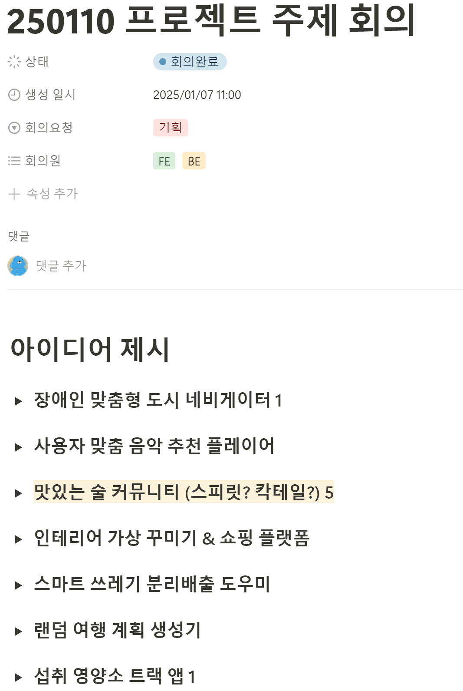
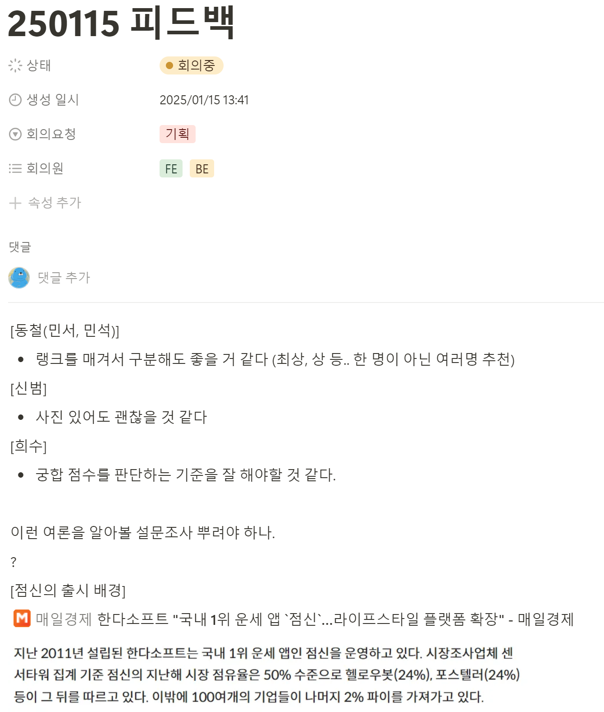
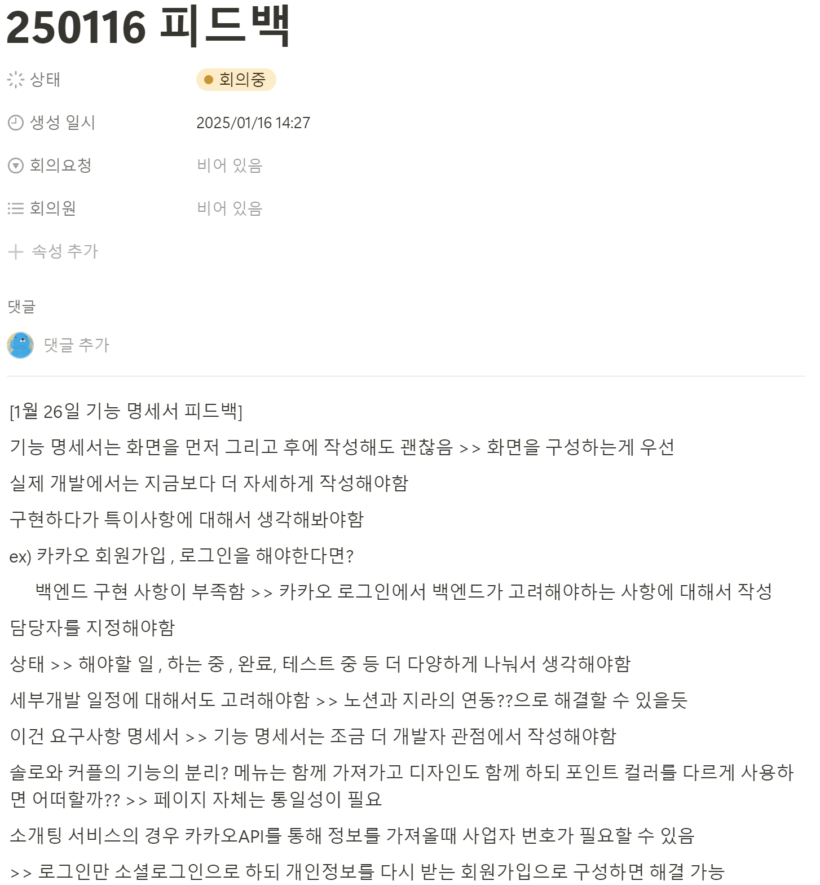
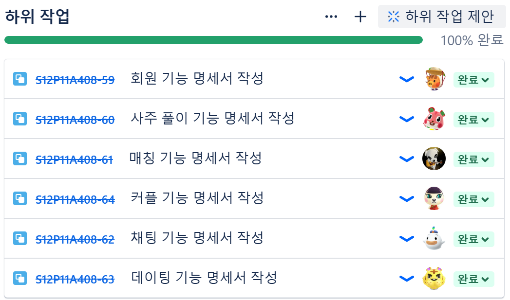
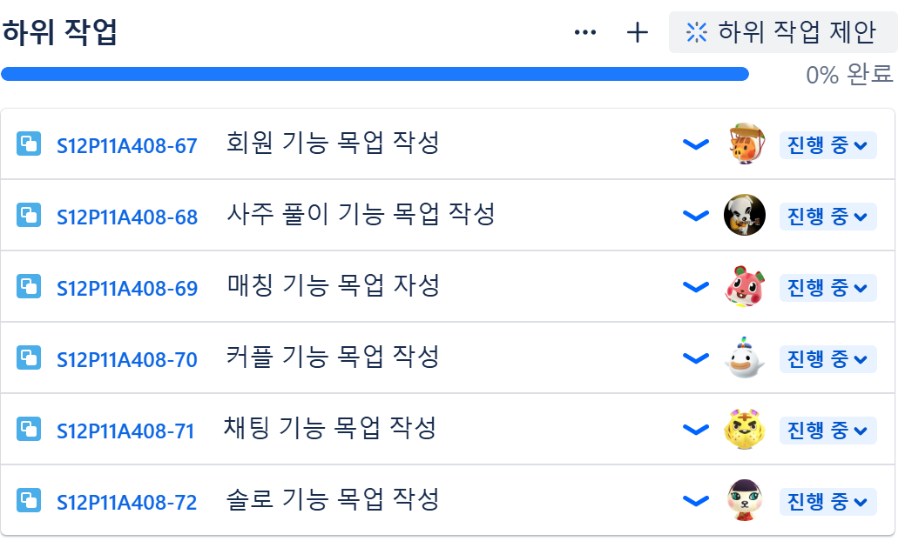

### Notion 회의
---
#### 1. 아이디어 회의

#### 2. 1차 피드백 적용

#### 3. 2차 피드백 적용

### JIRA 수행
---
#### 1. JIRA 하위항목 - 명세서 작성

#### 2. JIRA 하위항목 - 목업 작성성

---
### 요구사항 명세서 작성
https://road-marscapone-17b.notion.site/a408-functions?pvs=74
